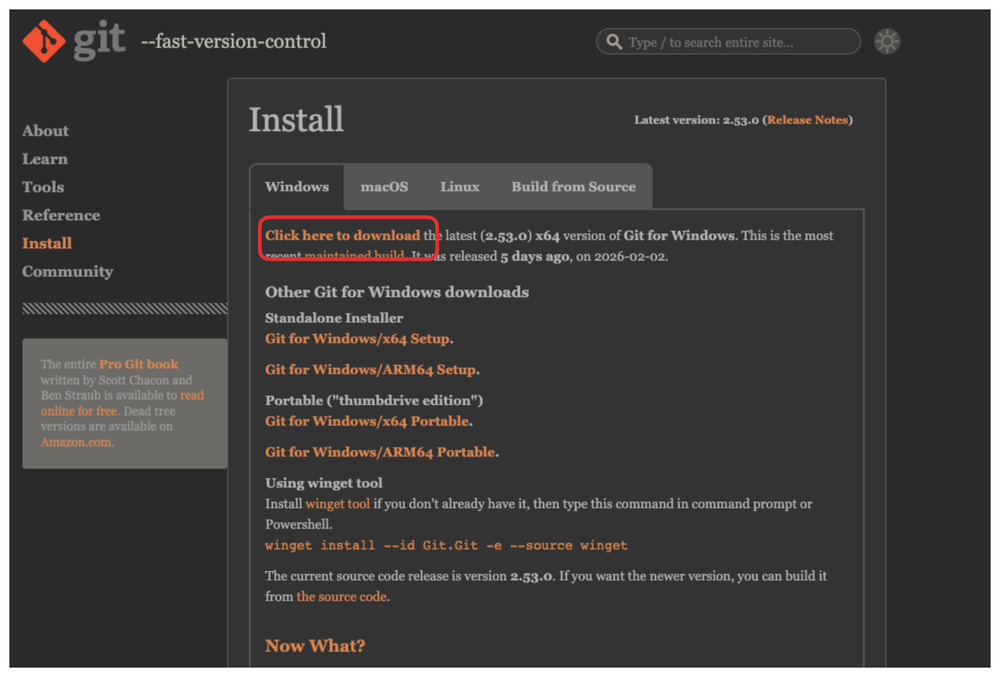
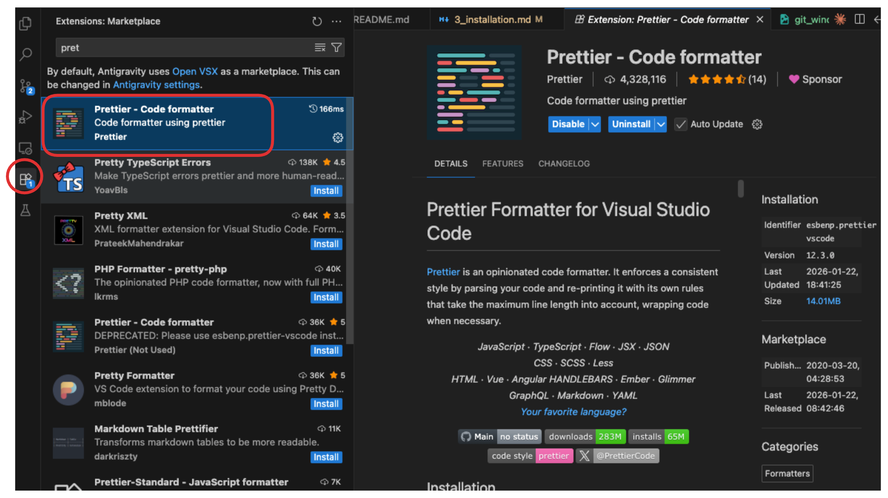
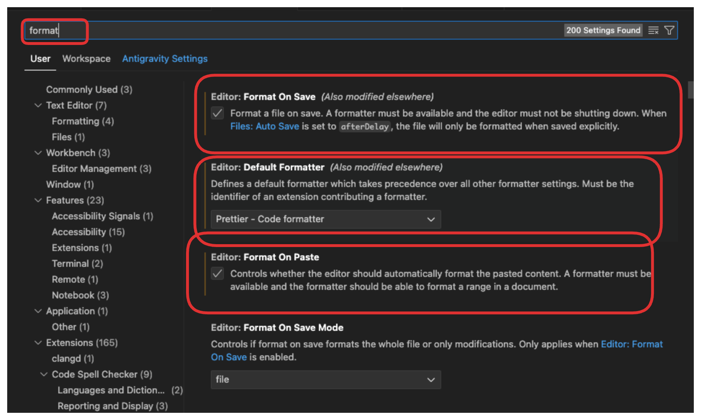
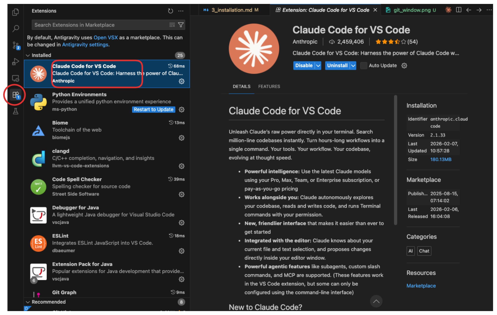
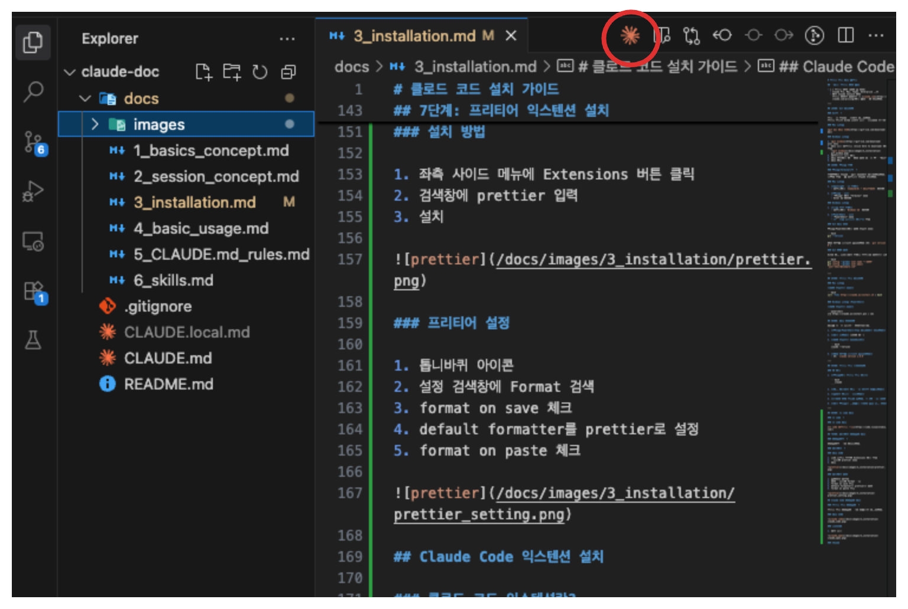
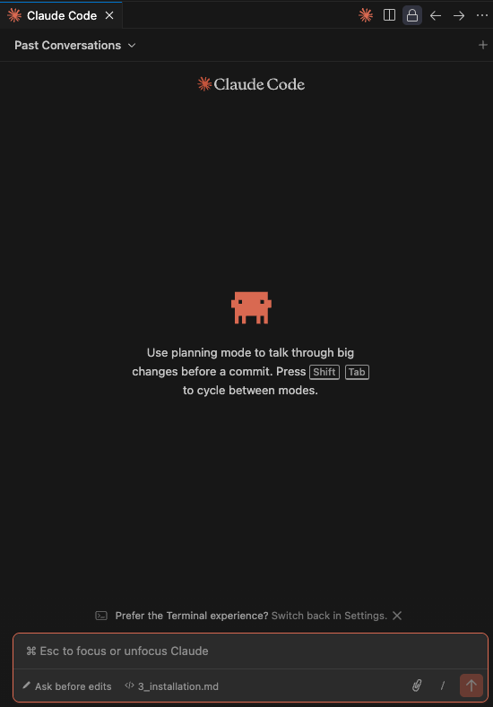

# 클로드 코드 설치 가이드

## 준비물: 클로드 계정 가입

- [ ] 클로드 계정 (아래 중 하나)
  - Claude Pro, Max, Teams, Enterprise 구독
  - 또는 Claude Console 계정
    클로드 계정이 없다면? -> [claude.com](https://claude.com/pricing)에서 가입할 수 있습니다.

---

## 1단계: Git 설치하기

### Git이란?

코드 변경 이력을 관리하는 도구입니다.
클로드 코드는 Git을 사용해 파일 변경사항을 추적하고 저장합니다.

### Mac 사용자

[git mac 설치 방법](https://git-scm.com/download/mac)

### Windows 사용자

1. [git window](https://git-scm.com/download/win) 방문
2. 설치 파일 다운로드 (Click here to download) 버튼 클릭
   
3. 다운로드한 파일 실행
4. 설치 화면에서 모든 기본 설정 그대로 두고 "Next" 클릭
5. 설치 완료

## 2단계: 터미널 열기

### 터미널(Terminal)이란?

컴퓨터에게 명령을 글자로 입력하는 프로그램입니다.
마우스 클릭 대신 키보드로 명령을 내립니다.

### Mac 사용자

1. **Spotlight 검색 열기**
   - 키보드에서 `Command(⌘) + 스페이스바` 누르기

2. **터미널 검색**
   - "터미널" 또는 "Terminal" 입력
   - Enter 키 누르기

### Windows 사용자

1. **시작 메뉴 열기**
   - 키보드에서 `Windows 키` 누르기

2. **PowerShell 검색**
   - "PowerShell" 입력
   - **"관리자 권한으로 실행"** 클릭

### Git 설치 확인

터미널/PowerShell에서 아래 명령어 입력:

```bash
git --version
```

버전 정보가 표시되면 성공입니다 (예: `git version 2.39.0`)

### Git 초기 설정

Git을 처음 사용한다면 이름과 이메일을 설정해야 합니다:

```bash
git config --global user.name "홍길동"
git config --global user.email "your-email@example.com"
```

---

## 3단계: 클로드 코드 설치하기

### Mac 사용자

**아래 명령어를 입력**

```bash
curl -fsSL https://claude.ai/install.sh | bash
```

### Windows 사용자 (PowerShell)

**아래 명령어를 입력**

```powershell
irm https://claude.ai/install.ps1 | iex
```

## 4단계: 설치 확인하기

설치가 제대로 되었는지 확인해봅시다.

1. **터미널/PowerShell/명령 프롬프트를 닫습니다**

2. **다시 엽니다** (1단계 참고)

3. **아래 명령어를 입력하세요**

   ```bash
   claude --version
   ```

4. **버전 정보가 표시되면 성공입니다**
   - 예: `claude version 1.0.0`

---

## 5단계: 클로드 코드 로그인하기

### 첫 실행

1. **터미널에서 클로드 코드 실행**

   ```bash
      claude
   ```

2. **처음 실행하면 모드 선택 화면이 나타납니다**

3. **원하는 모드를 선택합니다**

4. **로그인 옵션 보여줄 겁니다. -> 1번 선택 (그냥 엔터)**

5. **다시 터미널로 돌아와서 로그인 성공 문구 확인**

---

## 6단계: vs code 설치

### vs code란?

VS Code는 문서를 작성하고 편집하는 프로그램입니다.
워드나 한글 프로그램처럼 글을 쓸 수 있지만, 코드 작성에 특화되어 있습니다.
클로드 코드를 편하게 사용하려면 VS Code가 필요합니다.

### vs code 설치

[vs code 다운로드 링크](https://code.visualstudio.com/)

## 7단계: 프리티어 익스텐션 설치

### 익스텐션이란?

익스텐션은 VS Code에 추가 기능을 더해주는 부가 프로그램입니다.
스마트폰의 앱처럼, 필요한 기능을 설치해서 사용할 수 있습니다.

### 프리티어란?

프리티어(Prettier)는 문서의 형식을 자동으로 정리해주는 도구입니다.
예를 들어, 들여쓰기나 줄 간격을 자동으로 맞춰줍니다.
문서를 깔끔하게 유지하는 데 도움을 줍니다.

### 설치 방법

1. 좌측 사이드 메뉴에 Extensions 버튼 클릭
2. 검색창에 prettier 입력
3. 설치



### 프리티어 설정

1. 톱니바퀴 아이콘
2. 설정 검색창에 Format 검색
3. format on save 체크
4. default formatter를 prettier로 설정
5. format on paste 체크



## Claude Code 익스텐션 설치

### 클로드 코드 익스텐션란?

클로드 코드 익스텐션은 VS Code 안에서 클로드와 대화할 수 있게 해주는 도구입니다.
터미널을 열지 않고도 VS Code 화면에서 바로 클로드를 사용할 수 있습니다.

### 설치 방법



### 사용방법

1. 아무 파일을 열고
2. 우측 상단에 클로드 아이콘 클릭
3. 클로드와 대화 시작
   
   

### Claude Extension 단축키들

#### Mac 사용자

- **편집기와 클로드 간 포커스 전환**: `Command(⌘) + Esc`
  - 편집기에서 클로드로, 클로드에서 편집기로 이동할 때 사용
- **새 대화 열기 (탭)**: `Command(⌘) + '`
  - 새 대화를 편집기 탭으로 열기
- **새 대화 시작**: `Command(⌘) + N`
  - 현재 클로드 창에서 새 대화 시작 (클로드가 활성화되어 있어야 함)
- **파일/선택 영역 참조 추가**: `Option(⌥) + K`
  - 현재 파일이나 선택한 부분을 클로드에게 보내기 (편집기가 활성화되어 있어야 함)

#### Windows/Linux 사용자

- **편집기와 클로드 간 포커스 전환**: `Ctrl + Esc`
  - 편집기에서 클로드로, 클로드에서 편집기로 이동할 때 사용
- **새 대화 열기 (탭)**: `Ctrl + Shift + Esc`
  - 새 대화를 편집기 탭으로 열기
- **새 대화 시작**: `Ctrl + N`
  - 현재 클로드 창에서 새 대화 시작 (클로드가 활성화되어 있어야 함)
- **파일/선택 영역 참조 추가**: `Alt + K`
  - 현재 파일이나 선택한 부분을 클로드에게 보내기 (편집기가 활성화되어 있어야 함)
