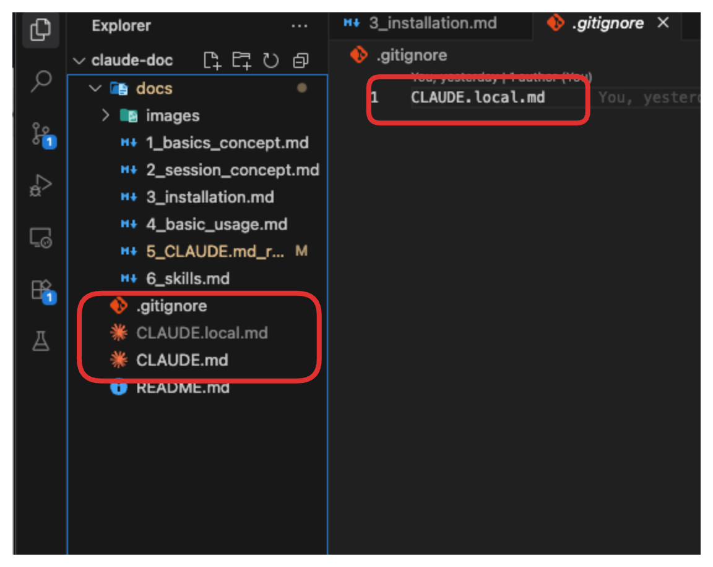

# CLAUDE.md 파일과 룰 설정

클로드 코드는 세션이 시작될 때마다 CLAUDE.md 파일을 읽습니다.

CLAUDE.md 파일에 작성된 내용은 클로드와의 모든 대화에서 자동으로 적용됩니다.

- 매번 대화할 때마다 같은 규칙을 반복해서 말할 필요가 없습니다
- 한 번 파일에 작성하면 클로드가 항상 그 규칙을 기억합니다

## 언제 사용하나요?

다음과 같은 상황에서 사용합니다:

- **프로젝트 작업 규칙**: "항상 이렇게 해주세요"라는 규칙이 있을 때
- **반복적인 요청 방지**: 매번 같은 요청을 하기 번거로울 때
- **팀 협업 규칙**: 여러 사람이 함께 작업할 때 일관된 방식을 유지하고 싶을 때

## 사용 예시

```md
- 모든 문서는 한국어로 작성하세요
- 기획서는 목적, 목표를 작성하세요
- 우선순위는 1(긴급), 2(높음), 3(보통), 4(낮음)으로 표시하세요
```

## 최적 길이

500줄 이내로 작성하는 것이 좋습니다.

## 계층 CLAUDE.md 파일

CLAUDE.md 파일은 계층적으로 관리할 수 있습니다.

상위 폴더의 CLAUDE.md 파일부터 시작해서 현재 폴더의 CLAUDE.md 파일까지 순서대로 읽습니다.

가까운 폴더의 CLAUDE.md 파일이 상위 폴더의 내용을 덮어씁니다.

### 폴더 구조 예시

```
회사-문서/                          # 최상위 폴더
├── CLAUDE.md                       # 회사 전체 규칙
│   내용: 모든 문서는 한글로 작성
│
└── 마케팅팀/                       # 부서 폴더
    ├── CLAUDE.md                   # 부서 규칙
    │   내용: 제목은 20자 이내로 작성
    │
    └── 신제품-출시/                # 프로젝트 폴더
        └── CLAUDE.md               # 프로젝트 규칙
            내용: 제목은 10자 이내로 작성
```

## CLAUDE.md 유형

| 유형            | 위치                                                                                                                                                        | 목적                                | 사용 예시                                        | 범위                    | 관리 정책                |
| --------------- | ----------------------------------------------------------------------------------------------------------------------------------------------------------- | ----------------------------------- | ------------------------------------------------ | ----------------------- | ------------------------ |
| 조직            | • macOS: `/Library/Application Support/ClaudeCode/CLAUDE.md`<br>• Linux: `/etc/claude-code/CLAUDE.md`<br>• Windows: `C:\Program Files\ClaudeCode\CLAUDE.md` | IT/DevOps가 관리하는 조직 전체 지침 | 회사 코딩 표준, 보안 정책, 컴플라이언스 요구사항 | 조직의 모든 사용자      | 관리자만 수정 가능       |
| 프로젝트        | `./CLAUDE.md` 또는 `./.claude/CLAUDE.md`                                                                                                                    | 프로젝트 팀이 공유하는 지침         | 프로젝트 아키텍처, 코딩 표준, 공통 워크플로우    | 소스 관리를 통한 팀원들 | Git으로 관리             |
| 프로젝트 규칙   | `./.claude/rules/*.md`                                                                                                                                      | 모듈식 주제별 프로젝트 지침         | 언어별 가이드라인, 테스팅 규칙, API 표준         | 소스 관리를 통한 팀원들 | Git으로 관리             |
| 사용자          | `~/.claude/CLAUDE.md`                                                                                                                                       | 모든 프로젝트에 대한 개인 선호사항  | 코드 스타일 선호도, 개인 도구 단축키             | 나만 (모든 프로젝트)    | 개인이 관리              |
| 프로젝트 (로컬) | `./CLAUDE.local.md`                                                                                                                                         | 프로젝트별 개인 선호사항            | 개인 샌드박스 URL, 선호하는 테스트 데이터        | 나만 (현재 프로젝트)    | 개인이 관리 (.gitignore) |

### 개인용 CLAUDE.local.md



CLAUDE.local.md 파일은 나만 사용하는 개인 설정 파일입니다.

이 파일은 자동으로 `.gitignore` 파일에 추가됩니다.

- `.gitignore`란? 팀원들과 공유하지 않을 파일 목록입니다.
- 이 목록에 있는 파일은 Git에 기록되지 않아 다른 사람에게 공유되지 않습니다.

## .claude/rules/ 폴더로 규칙 나누기

프로젝트가 커지면 규칙을 여러 파일로 나누어 관리할 수 있습니다.

`.claude/rules/` 폴더를 만들어서 주제별로 규칙 파일을 나누면 됩니다.

### 폴더 구조

```
프로젝트-폴더/
├── .claude/
│   ├── CLAUDE.md              # 기본 프로젝트 규칙
│   └── rules/
│       ├── 문서작성.md        # 문서 작성 규칙
│       ├── 기획서.md          # 기획서 작성 규칙
│       └── 회의록.md          # 회의록 작성 규칙
```

`.claude/rules/` 폴더 안의 모든 `.md` 파일은 자동으로 읽어집니다.

이 파일들은 `.claude/CLAUDE.md` 파일과 같은 우선순위를 갖습니다.
